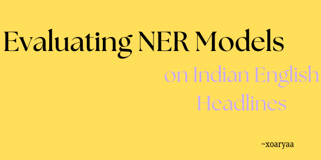
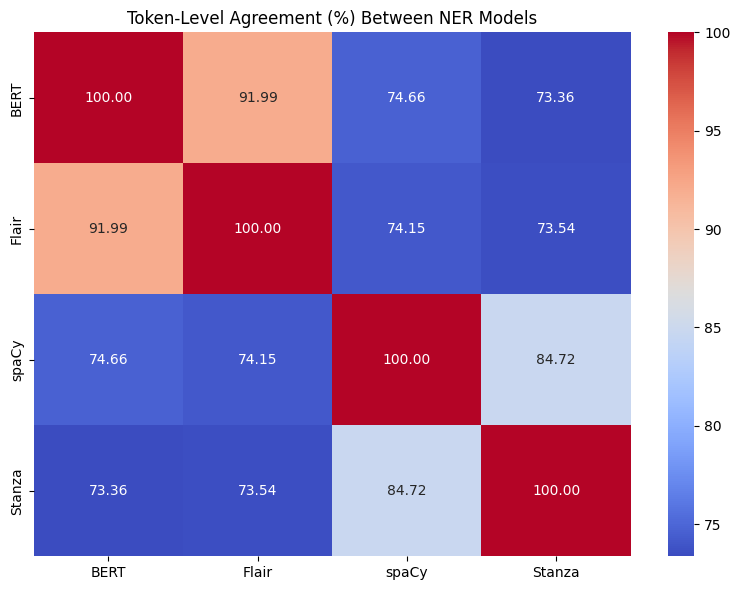

# Evaluating Named Entity Recognition (NER) Models on Indian English News Headlines

<p align="center">
  
</p>

<p align="center">
  <a href="https://colab.research.google.com/drive/1Rjxn4a2XeCP88S8CUWr9lvwiNG8_Szcs?usp=drive_open">
    
  </a>
  
  
</p>

**TL;DR.** This repo benchmarks multiple NER toolkits—**spaCy**, **Flair**, **Stanza**, and a **BERT-based** token classification model—on *Indian English news headlines*. It includes data prep from Label Studio JSON, unified training/evaluation scripts, per-label F1, error analysis, and **token-level agreement** between models.

---

## ✨ Highlights
- Unified pipeline to prep, train (where applicable), and evaluate across **spaCy/Flair/Stanza/BERT**.
- **Label Studio → BIO** conversion + robust splits.
- Standard metrics (per-label precision/recall/F1).
- **Agreement analysis** (BIO tag agreement).
- Reproducible figures: per-label bar plots, confusion diagrams, agreement heatmaps.

---


## 🧰 Setup

### Option A: Quickstart (Colab)
1. Open the **Colab badge** above or any notebook under `notebooks/`.
2. Run the first cell to `pip install -r requirements.txt`.
3. Upload your Label Studio JSON to `data/raw/` (or mount Drive), then run the *Data prep* cell.

### Option B: Local (conda)
```bash
conda create -n ner-eval python=3.10 -y
conda activate ner-eval
pip install -r requirements.txt
python -m spacy download en_core_web_sm   # or larger model if you like
python -c "import stanza; stanza.download('en')"
```

> Minimal `requirements.txt` (edit as needed):
> ```
> spacy>=3.7
> flair>=0.13
> stanza>=1.8
> transformers>=4.43
> datasets>=2.20
> seqeval>=1.2
> scikit-learn>=1.4
> matplotlib>=3.8
> pandas>=2.2
> numpy>=1.26
> ```

---


## 📈 Results (F1 Scores)


| Model   | Event    | Location | Misc   | ORG    | Person | 
|--------:|:--------:|:--------:|:------:|:------:|:------:|
| spaCy   |  0.06    | 0.35     | 0.00   | 0.33   | 0.39   | 
| Flair   |  0.00    | **0.59**     | 0.09   | 0.45   | **0.78**   | 
| Stanza  |  0.16    | 0.57     | 0.05   | 0.52   | **0.63**   | 
| BERT    |  0.00    | 0.39     | 0.11   | 0.41   | 0.22   | 


---

## 🤝 Token-Level Agreement

Compute agreement across model outputs on the same test set:

<p align="center">
  
</p>


This script:
- Aligns tokens,
- Computes pairwise agreement (% agreement)


---

## 🔍 Error Analysis
- **Confusions**: `ORG ↔️ LOC` in news headlines, ambiguous Indian entities (e.g., ministries, cricket teams, states vs. cities).  
- **Headlines**: Ellipsis, abbreviations, and lack of context hurt recall.  
- **Domain-specific tokens**: Indianized spellings (e.g., “hon’ble”, “pvt”, “co-op”)—consider normalization rules.

---

## ⚠️ Limitations & Ethics
- **Headline bias** (short, context-poor text).  
- **Label ambiguity**: Organization vs. location vs. product in Indian contexts.  
- **Generalization**: Models trained on global English may underperform on Indian named entities.  
- **Responsible use**: Avoid downstream decisions that impact people without human review.

---

## 🗺️ Roadmap
- [ ] Larger label set (e.g., `GPE`, `EVENT`, `LAW`).  
- [ ] Add Indic-friendly encoders (e.g., `xlm-roberta-base`).  
- [ ] Robust span-level calibration curves.  
- [ ] Active learning loop with Label Studio webhooks.

---


## 📝 License
This project is released under the **MIT License**. See `LICENSE` for details.

---

## 🙌 Acknowledgements
- Label Studio for annotation tooling.
- spaCy, Flair, Stanza, and Hugging Face for open-source NER stacks.
- Early feedback from peers on Indian news domain edge cases.

---

## 📨 Contact
- **Maintainer**: Arya Tayshete — avtayshete_b21@et.vjti.ac.in  
- **Issues**: Please open a GitHub Issue to reproduce.
